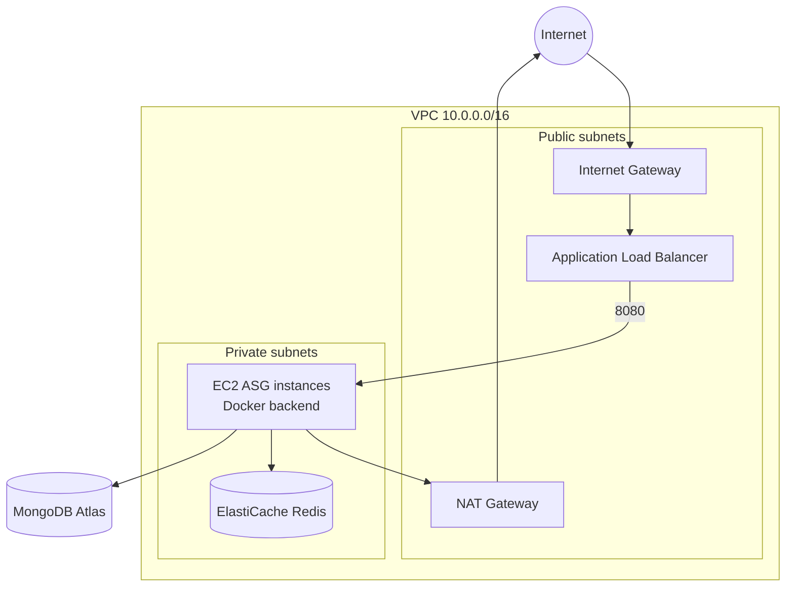
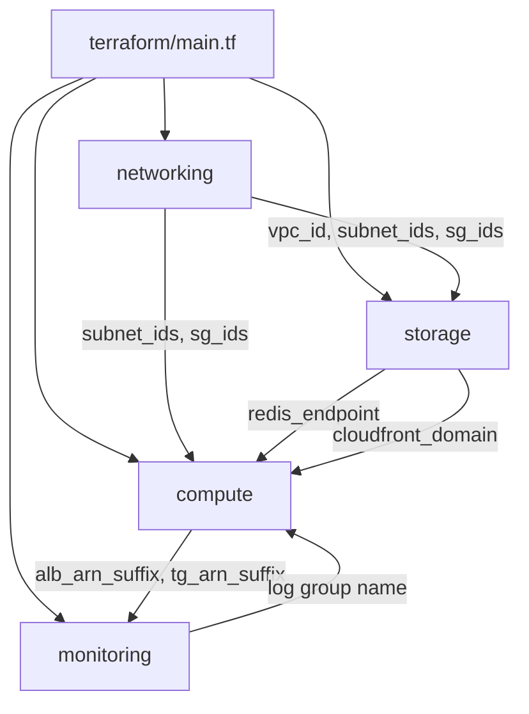
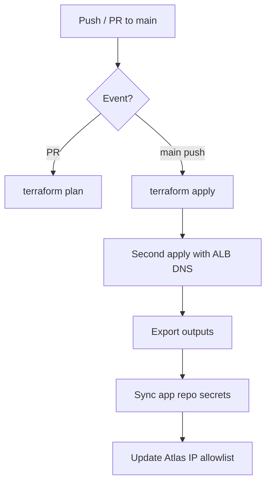

# StartTech Infrastructure — Architecture

AWS infrastructure for the StartTech full-stack application, defined as Terraform modules and deployed via GitHub Actions.

---

## Design goals

- **High availability** — Multi-AZ subnets, ALB health checks, ASG with rolling updates
- **Security** — Private backend tier, least-privilege IAM, no public Redis/MongoDB
- **Operability** — Centralized logging, alarms, SNS notifications
- **Automation** — CI plan/apply, secret sync to application repo, Atlas IP management
- **Cost awareness** — `t3.micro` instances, single-node Redis, NAT gateway as main fixed cost

---

## Regional deployment

| Setting | Value |
|---------|-------|
| Primary region | `us-east-1` (configurable via `aws_region`) |
| Availability zones | `us-east-1a`, `us-east-1b` |
| Environment tag | `prod` (via `environment` variable) |
| Project prefix | `starttech` (via `project_name`) |

---

## Network architecture



### Subnets

| Subnet | CIDR | AZ | Purpose |
|--------|------|-----|---------|
| Public 1 | `10.0.1.0/24` | AZ-a | ALB, NAT |
| Public 2 | `10.0.2.0/24` | AZ-b | ALB |
| Private 1 | `10.0.10.0/24` | AZ-a | EC2, Redis |
| Private 2 | `10.0.11.0/24` | AZ-b | EC2, Redis |

### Routing

- **Public route table** → `0.0.0.0/0` via Internet Gateway
- **Private route table** → `0.0.0.0/0` via NAT Gateway (outbound only)

Backend instances have **no public IP**. Inbound API traffic arrives only through the ALB.

### Security groups

| SG | Inbound | Outbound |
|----|---------|----------|
| **ALB** | 80, 443 from `0.0.0.0/0` | All |
| **Backend EC2** | 8080 from ALB SG only | All (Docker pull, Atlas, CloudWatch, etc.) |
| **Redis** | 6379 from Backend SG only | All |

---

## Compute architecture

### Application Load Balancer

- Internet-facing, HTTP port 80
- Target group: port 8080, health check `GET /health` (expect 200)
- Registers EC2 instances from ASG

### Auto Scaling Group

| Setting | Default |
|---------|---------|
| Min size | 1 |
| Max size | 3 |
| Desired | 2 |
| Health check | ELB |
| Grace period | 120 seconds |
| Subnets | Private |
| Update strategy | Rolling instance refresh (50% min healthy) |

### Launch template

- Amazon Linux 2 AMI (`ami_id` variable)
- Instance type (`t3.micro` default)
- IAM instance profile: `starttech-ec2-profile`
- User-data: install Docker, run backend container (see below)

### Scaling policies

| Alarm | Threshold | Action |
|-------|-----------|--------|
| `starttech-high-cpu` | CPU > 70% (2 × 120s) | Scale out +1 |
| `starttech-low-cpu` | CPU < 30% (2 × 120s) | Scale in -1 |

Cooldown: 300 seconds between scaling activities.

### EC2 IAM role

- Trust: `ec2.amazonaws.com`
- Attached: `CloudWatchAgentServerPolicy` (managed) — covers CloudWatch Logs write for Docker `awslogs` and agent use

### User-data / container runtime

Rendered from `modules/compute/user_data.sh.tpl`:

```bash
docker run -d \
  --log-driver=awslogs \
  --log-opt awslogs-group="/starttech/prod/backend" \
  --log-opt awslogs-stream="backend-logs" \
  -e ENABLE_CACHE=true \
  -e REDIS_ADDR="<elasticache-host>:6379" \
  -e MONGO_URI="..." \
  -e ALLOWED_ORIGINS="http://localhost:5173,https://<cloudfront-domain>" \
  -e LOG_FORMAT=json \
  ...
```

Logging path: **container stdout → Docker awslogs → CloudWatch**. No dependency on log files under `/var/log/app`.

---

## Storage & CDN architecture

### S3 frontend bucket

- Private bucket (public access blocked)
- Website configuration with `index.html` error fallback for SPA
- Bucket policy allows **only** CloudFront OAC reads

### CloudFront distribution

| Behavior | Origin | Caching |
|----------|--------|---------|
| Default (`/*`) | S3 | TTL 1h default, 24h max |
| `/auth/*`, `/tasks/*`, `/users/*`, `/health`, `/ping`, `/swagger/*`, `/api/*` | ALB (HTTP) | TTL 0 (no cache) |

**API proxy:** When `alb_dns_name` is set, CloudFront forwards API paths to the ALB. Browsers use HTTPS to CloudFront only, eliminating mixed-content issues.

Custom error responses: 403/404 → 200 `/index.html` for client-side routing.

### ElastiCache Redis

| Setting | Value |
|---------|-------|
| Engine | Redis 7 |
| Node type | `cache.t3.micro` |
| Nodes | 1 |
| Port | 6379 |
| Subnet group | Private subnets (multi-AZ) |
| Cluster ID | `starttech-redis` |

Used by backend for username and todo list caching.

---

## Monitoring & observability architecture

### CloudWatch log groups

| Log group | Purpose |
|-----------|---------|
| `/starttech/<env>/backend` | Backend container logs (awslogs) |
| `/starttech/<env>/cloudfront` | Reserved for CloudFront access logs |

Log stream (Terraform-managed): `backend-logs`

Retention: 30 days (configurable via `log_retention_days`).

### Alarms

| Alarm | Metric | Threshold |
|-------|--------|-----------|
| `starttech-alb-5xx-high` | `HTTPCode_Target_5XX_Count` | > 10 / minute |
| `starttech-alb-latency-high` | `TargetResponseTime` p99 | > 3 seconds |
| `starttech-high-cpu` | `CPUUtilization` (ASG) | > 70% |
| `starttech-low-cpu` | `CPUUtilization` (ASG) | < 30% |

ALB alarms → SNS topic `starttech-alerts` → email (`alert_email`).

### Dashboard

Terraform creates `starttech-<env>` dashboard with ALB request count, 5xx, and p99 latency widgets.

Reference definitions: `monitoring/cloudwatch-dashboard.json`, `monitoring/alarm-definitions.json`.

### Log Insights

Pre-built queries in `monitoring/log-insights-queries.txt` for errors, cache-related messages, and latency parsing.

---

## Terraform module graph



### Module: networking

**Outputs:** `vpc_id`, `public_subnet_ids`, `private_subnet_ids`, `alb_security_group_id`, `backend_security_group_id`, `redis_security_group_id`

### Module: storage

**Inputs:** networking outputs, `frontend_bucket_name`, `alb_dns_name`

**Outputs:** `frontend_bucket_name`, `cloudfront_distribution_id`, `cloudfront_domain_name`, `redis_endpoint`

### Module: monitoring

**Inputs:** `alb_arn_suffix`, `target_group_arn_suffix` from compute (full ARN suffixes for metric dimensions)

**Outputs:** `backend_log_group_name`, `backend_log_stream_name`, `alerts_sns_topic_arn`

### Module: compute

**Inputs:** networking, `redis_endpoint`, `mongo_uri`, `docker_image`, `cloudwatch_log_group`, `aws_region`

**Outputs:** `alb_dns_name`, `alb_arn`, `alb_arn_suffix`, `target_group_arn`, `target_group_arn_suffix`, `autoscaling_group_name`, IAM names

---

## State management

| Setting | Value |
|---------|-------|
| Backend | S3 |
| Key | `prod/terraform.tfstate` |
| Locking | S3 native (Terraform 1.5+) |

CI discovers bucket: `starttech-terraform-state-<account>-<region>`.

**Never commit** `terraform.tfvars` or state files to git.

---

## CI/CD architecture (infrastructure-deploy.yml)



### Pipeline stages

1. Checkout, AWS credentials
2. `terraform fmt -check`
3. Ensure state S3 bucket exists
4. `terraform init` with dynamic backend config
5. Validate secrets (`ALERT_EMAIL` format, `ALB_DNS_NAME` cleanup)
6. `terraform validate`
7. PR: `terraform plan` only
8. Main: `terraform apply` (+ optional second apply for CloudFront ALB origin)
9. Export outputs to workflow summary
10. Sync secrets to `starttech-application` via `gh secret set`
11. Atlas NAT IP allowlist maintenance

---

## External dependencies

| Service | Integration |
|---------|-------------|
| **MongoDB Atlas** | Connection string in `mongo_uri`; NAT IP on allowlist |
| **Docker Hub** | Image pull on EC2 boot; tag updated by app CI/CD |
| **GitHub** | Actions secrets, cross-repo PAT |

Atlas is **not** managed by this Terraform code.

---

## Security considerations

- EC2 in private subnets; SSH not configured by default (use SSM Session Manager if enabled separately)
- Redis not internet-accessible
- `mongo_uri` marked `sensitive` in Terraform
- S3 bucket encrypted and blocked from public access
- CloudFront OAC enforces SigV4 for S3 origin
- IAM policies split for CI least privilege (`iam/` directory)

---

## Environment divergence

Currently a single `prod` environment is modeled via `environment` variable. To add staging:

1. Duplicate backend state key (e.g. `staging/terraform.tfstate`)
2. Adjust `project_name` or use workspace
3. Separate `terraform.tfvars` per environment
4. Separate GitHub environments/secrets

---

## Related documentation

- [README.md](./README.md) — Setup and deployment
- [RUNBOOK.md](./RUNBOOK.md) — Operations and troubleshooting
- [starttech-application ARCHITECTURE.md](../starttech-application/ARCHITECTURE.md) — Application layer
