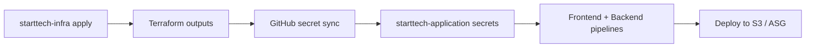

[](https://github.com/esodevops/starttech-infra/actions/workflows/infrastructure-deploy.yml)

# StartTech Infrastructure

Terraform and CI/CD for the AWS platform that hosts the [StartTech application](../starttech-application/README.md).

| Component | AWS service |
|-----------|-------------|
| Backend API | EC2 Auto Scaling Group + Application Load Balancer |
| Frontend | S3 + CloudFront CDN |
| Cache | ElastiCache Redis 7 |
| Database | MongoDB Atlas (external) |
| Logging | CloudWatch Logs |
| Alerting | CloudWatch Alarms → SNS → Email |
| State | S3 remote backend |

---

## Repository structure

```
starttech-infra/
├── .github/workflows/
│   └── infrastructure-deploy.yml   # Plan on PR, apply on main, sync secrets, Atlas IP
├── terraform/
│   ├── main.tf                     # Root module wiring
│   ├── variables.tf
│   ├── outputs.tf
│   ├── terraform.tfvars.example    # Copy → terraform.tfvars (never commit)
│   └── modules/
│       ├── networking/             # VPC, subnets, IGW, NAT, security groups
│       ├── storage/                # S3, CloudFront, ElastiCache Redis
│       ├── monitoring/             # CloudWatch logs, alarms, dashboard, SNS
│       └── compute/                # ALB, launch template, ASG, scaling policies
├── iam/
│   ├── starttech-infra-ci-bootstrap.json
│   ├── starttech-infra-ci-network.json
│   ├── starttech-infra-ci-observability.json
│   └── starttech-assessor-policy.json
├── scripts/
│   ├── deploy-infrastructure.sh
│   └── cleanup-infrastructure.sh
├── monitoring/
│   ├── cloudwatch-dashboard.json
│   ├── alarm-definitions.json
│   └── log-insights-queries.txt
├── README.md
├── ARCHITECTURE.md
└── RUNBOOK.md
```

---

## Prerequisites

| Requirement | Notes |
|-------------|-------|
| Terraform | >= 1.5 |
| AWS CLI | v2, configured credentials |
| AWS account | With permissions to create VPC, EC2, ELB, S3, CloudFront, ElastiCache, IAM |
| MongoDB Atlas | Cluster + connection string for `mongo_uri` |
| Docker Hub image | Backend image referenced in `docker_image` variable |
| GitHub repo secrets | For CI/CD (see below) |

---

## One-time setup

### 1. Terraform state bucket

Terraform state is stored in S3. The CI pipeline creates a per-account bucket if missing:

`starttech-terraform-state-<ACCOUNT_ID>-<REGION>`

Manual creation (if not using CI bootstrap):

```bash
export AWS_REGION=us-east-1
export ACCOUNT_ID=$(aws sts get-caller-identity --query Account --output text)
export BUCKET="starttech-terraform-state-${ACCOUNT_ID}-${AWS_REGION}"

aws s3api create-bucket --bucket "$BUCKET" --region "$AWS_REGION"
aws s3api put-bucket-versioning --bucket "$BUCKET" \
  --versioning-configuration Status=Enabled
```

Update `terraform/main.tf` backend `bucket` if you use a fixed name instead of the CI-discovered bucket.

### 2. Create `terraform.tfvars`

```bash
cd terraform
cp terraform.tfvars.example terraform.tfvars
# Edit with your values — NEVER commit terraform.tfvars
```

| Variable | Description |
|----------|-------------|
| `aws_region` | e.g. `us-east-1` |
| `project_name` | Resource prefix, default `starttech` |
| `environment` | e.g. `prod` |
| `ami_id` | Amazon Linux 2 AMI for EC2 |
| `instance_type` | e.g. `t3.micro` |
| `docker_image` | e.g. `user/much-to-do-backend:latest` |
| `mongo_uri` | MongoDB Atlas connection string (sensitive) |
| `frontend_bucket_name` | Globally unique S3 bucket name |
| `alert_email` | SNS alarm subscription email |
| `alb_dns_name` | ALB DNS for CloudFront API proxy (can set after first apply) |

### 3. Initialize Terraform

```bash
cd terraform
terraform init \
  -backend-config="bucket=<your-state-bucket>" \
  -backend-config="key=prod/terraform.tfstate" \
  -backend-config="region=us-east-1"
```

### 4. GitHub Actions secrets (starttech-infra)

| Secret | Required | Description |
|--------|----------|-------------|
| `AWS_ACCESS_KEY_ID` | Yes | IAM user/role for Terraform |
| `AWS_SECRET_ACCESS_KEY` | Yes | IAM secret |
| `AMI_ID` | Yes | EC2 AMI |
| `DOCKER_IMAGE` | Yes | Backend Docker image URI |
| `MONGO_URI` | Yes | Atlas connection string |
| `FRONTEND_BUCKET_NAME` | Yes | S3 bucket name |
| `ALERT_EMAIL` | Yes | Alarm notifications |
| `ALB_DNS_NAME` | Optional | CloudFront API origin; CI can auto-discover |
| `ATLAS_PUBLIC_KEY` | Yes* | Atlas API key for IP allowlist |
| `ATLAS_PRIVATE_KEY` | Yes* | Atlas API private key |
| `ATLAS_PROJECT_ID` | Yes* | Atlas project/group ID |
| `APP_REPO_SECRETS_PAT` | Optional | PAT to sync outputs to application repo |

\*Required for automated NAT → Atlas IP allowlist step.

---

## Deploying infrastructure

### Via GitHub Actions (recommended)

1. Open a PR changing `terraform/**` → workflow runs `terraform plan`.
2. Merge to `main` → `terraform apply` (auto-approve).
3. Pipeline may run **apply twice** on first deploy to inject fresh ALB DNS into CloudFront API origin.
4. Review workflow summary for outputs to copy into application repo secrets.
5. Confirm SNS email subscription (check inbox, click confirm link).

### Via local script

```bash
chmod +x scripts/deploy-infrastructure.sh
./scripts/deploy-infrastructure.sh
```

### Manual Terraform

```bash
cd terraform
terraform plan -var-file=terraform.tfvars
terraform apply -var-file=terraform.tfvars
```

---

## Terraform outputs

After `terraform apply`:

| Output | Use |
|--------|-----|
| `frontend_url` | Public HTTPS URL for React app |
| `backend_url` | ALB HTTP URL for API |
| `frontend_bucket_name` | S3 deploy target |
| `cloudfront_distribution_id` | Cache invalidation |
| `autoscaling_group_name` | Backend rolling deploys |
| `backend_log_group` | CloudWatch log group path |
| `backend_log_stream` | Log stream name (`backend-logs`) |

```bash
terraform output
curl "$(terraform output -raw backend_url)/health"
```

---

## IAM policies (least privilege)

Split policies under `iam/` for CI principals:

| File | Scope |
|------|-------|
| `starttech-infra-ci-bootstrap.json` | S3 state, basic reads |
| `starttech-infra-ci-network.json` | VPC, subnets, SG, NAT, ALB, EC2, ASG |
| `starttech-infra-ci-observability.json` | CloudWatch, SNS, ElastiCache, CloudFront |
| `starttech-assessor-policy.json` | Read-only style access for reviewers |

Attach combined policies to the IAM user used by GitHub Actions. Migrate off `AdministratorAccess` once `terraform plan` and `apply` succeed with the scoped policies.

---

## Cross-repository integration



### Automated secret sync

On successful apply to `main`, workflow step **Sync outputs to application and infra secrets** sets in `starttech-application`:

- `S3_BUCKET_NAME`
- `CLOUDFRONT_DISTRIBUTION_ID`
- `REACT_APP_API_URL`
- `CLOUDWATCH_LOG_GROUP`
- `CLOUDWATCH_LOG_STREAM`

Requires `APP_REPO_SECRETS_PAT` with permission to manage Actions secrets on the target repo.

### MongoDB Atlas IP allowlist

Workflow step **Update MongoDB Atlas Access List** adds the NAT Gateway public IP and removes stale `NAT Gateway IP` entries. Requires Atlas API keys in GitHub secrets.

### Backend Docker image

`docker_image` in `terraform.tfvars` must match the image pushed by application CI (`DOCKERHUB_USERNAME/much-to-do-backend`). EC2 user-data runs `docker pull` on instance boot.

---

## Module overview

| Module | Creates |
|--------|---------|
| **networking** | VPC `10.0.0.0/16`, 2 public + 2 private subnets, IGW, NAT, route tables, SGs (ALB, backend, Redis) |
| **storage** | S3 frontend bucket, CloudFront (+ ALB origin for API paths), ElastiCache Redis |
| **monitoring** | Log groups, SNS alerts, ALB/CPU alarms, dashboard |
| **compute** | ALB, target group, IAM instance profile, launch template, ASG, scaling policies |

Module dependency order in `main.tf`: networking → storage → monitoring ↔ compute (circular outputs resolved by Terraform graph).

---

## Backend EC2 configuration (user-data)

Launch template renders `modules/compute/user_data.sh.tpl`:

- Installs Docker, pulls `${docker_image}`
- Runs container with `ENABLE_CACHE=true`, `REDIS_ADDR`, `MONGO_URI`, `ALLOWED_ORIGINS`
- Ships logs via Docker **`awslogs`** to `${cloudwatch_log_group}` (stream `backend-logs`)

After changing user-data, run **ASG instance refresh** (application backend pipeline does this on deploy).

---

## Destroying infrastructure

```bash
cd terraform
terraform destroy -var-file=terraform.tfvars
```

Or:

```bash
./scripts/cleanup-infrastructure.sh
```

**Warning:** Destroys VPC, ALB, EC2, Redis, S3 bucket (if `force_destroy`), CloudFront. Atlas data is external and preserved.

---

## Additional documentation

- [ARCHITECTURE.md](./ARCHITECTURE.md) — Network topology, security, data flows
- [RUNBOOK.md](./RUNBOOK.md) — Operations, incidents, Terraform troubleshooting
- [starttech-application README](../starttech-application/README.md) — App setup and CI/CD
