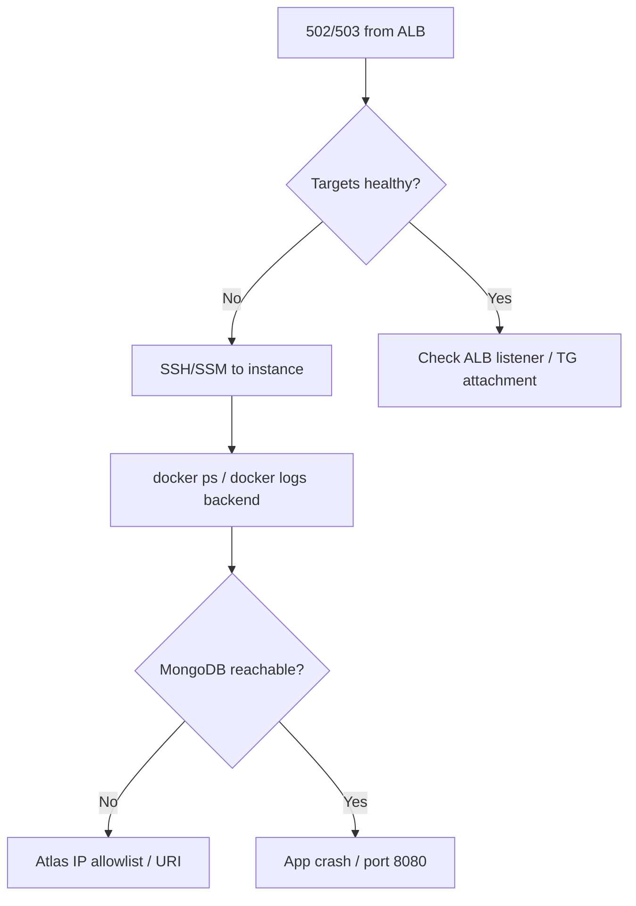

# StartTech Infrastructure — Operations & Troubleshooting Runbook

Operational procedures for Terraform-managed AWS infrastructure. Application-specific runbooks live in [starttech-application RUNBOOK.md](../starttech-application/RUNBOOK.md).

---

## Quick reference

| Resource | Typical name / path |
|----------|---------------------|
| VPC | `starttech-vpc` |
| ALB | `starttech-alb` |
| Target group | `starttech-backend-tg` |
| ASG | `starttech-asg` |
| Redis | `starttech-redis` |
| Backend log group | `/starttech/prod/backend` |
| Log stream | `backend-logs` |
| SNS topic | `starttech-alerts` |
| State bucket | `starttech-terraform-state-<account>-us-east-1` |
| Terraform state key | `prod/terraform.tfstate` |

---

## Routine operations

### Deploy infrastructure changes

**CI (recommended):**

1. Push branch, open PR → review `terraform plan` in Actions logs.
2. Merge to `main` → automatic `terraform apply`.
3. Review job summary for synced application secrets.
4. Confirm SNS subscription email if new topic.

**Local:**

```bash
./scripts/deploy-infrastructure.sh
```

**Verify after apply:**

```bash
cd terraform
terraform output
curl -s "$(terraform output -raw backend_url)/health"
```

### Update backend Docker image on existing infra

The launch template `docker_image` variable must match the image tag EC2 pulls. Options:

1. Update `DOCKER_IMAGE` GitHub secret / `terraform.tfvars` and `terraform apply`, **or**
2. Let application CI update launch template user-data image tag + ASG refresh (no Terraform change if only tag changes).

After user-data template changes, **always** refresh ASG instances.

### Refresh EC2 instances (pick up user-data / env changes)

```bash
aws autoscaling start-instance-refresh \
  --auto-scaling-group-name starttech-asg \
  --strategy Rolling \
  --preferences '{"MinHealthyPercentage": 50, "InstanceWarmup": 120}'
```

Monitor:

```bash
watch -n 30 'aws autoscaling describe-instance-refreshes \
  --auto-scaling-group-name starttech-asg \
  --query "InstanceRefreshes[0].[Status,PercentageComplete]" \
  --output text'
```

### Invalidate CloudFront (after manual S3 upload)

```bash
aws cloudfront create-invalidation \
  --distribution-id "$(cd terraform && terraform output -raw cloudfront_distribution_id)" \
  --paths "/*"
```

### Confirm SNS alarm subscription

AWS sends confirmation email to `alert_email`. Alarms will not notify until subscription status is **Confirmed**.

---

## Monitoring runbooks

### Check ALB health

```bash
ALB_DNS=$(aws elbv2 describe-load-balancers \
  --names starttech-alb \
  --query 'LoadBalancers[0].DNSName' --output text)

TG_ARN=$(aws elbv2 describe-target-groups \
  --names starttech-backend-tg \
  --query 'TargetGroups[0].TargetGroupArn' --output text)

aws elbv2 describe-target-health --target-group-arn "$TG_ARN"
```

All targets should be `healthy`. `unhealthy` → check instance `/health` and security groups.

### Review CloudWatch alarms

```bash
aws cloudwatch describe-alarms \
  --alarm-name-prefix starttech \
  --query 'MetricAlarms[*].[AlarmName,StateValue]' \
  --output table
```

| Alarm | Investigate when ALARM |
|-------|------------------------|
| `starttech-alb-5xx-high` | Backend errors, deploy regression, MongoDB down |
| `starttech-alb-latency-high` | DB slow queries, CPU saturation, cache cold |
| `starttech-high-cpu` | Traffic spike; ASG should scale out |
| `starttech-low-cpu` | Scale-in triggered; verify capacity still adequate |

### Tail backend logs

```bash
aws logs tail /starttech/prod/backend --follow --region us-east-1
```

Log Insights queries: `monitoring/log-insights-queries.txt`

**Filter cache activity:**

```
fields @timestamp, @message
| filter @message like /\[CACHE/
| sort @timestamp desc
| limit 50
```

### ElastiCache health

```bash
aws elasticache describe-cache-clusters \
  --cache-cluster-id starttech-redis \
  --show-cache-node-info \
  --query 'CacheClusters[0].CacheClusterStatus'
```

CloudWatch metrics: `CPUUtilization`, `CurrConnections`, `CacheHitRate`.

---

## Incident response

### ALB returns 502/503



**Steps:**

1. Target health (see above).
2. On instance: `sudo docker logs backend --tail 100`
3. Test MongoDB from instance (outbound via NAT).
4. Verify recent deploy / instance refresh status.
5. Roll back application image if regression suspected.

### No logs in CloudWatch

| Check | Command / location |
|-------|-------------------|
| Log group exists | `aws logs describe-log-groups --log-group-name-prefix /starttech` |
| Container logging driver | Instance: `docker inspect backend --format '{{.HostConfig.LogConfig}}'` |
| Expect `awslogs` type | |
| IAM role on instance | `aws ec2 describe-instances --filters Name=tag:Name,Values=starttech-backend` |
| Old instances | Run instance refresh after user-data fix |

### Redis unreachable from backend

1. `/health` shows `"cache": "down"`.
2. Verify Redis SG allows backend SG on 6379.
3. Verify Redis in same VPC private subnets.
4. From instance (if SSM available):

   ```bash
   redis-cli -h <redis-endpoint> -p 6379 ping
   ```

5. Check ElastiCache cluster status in console.

### CloudFront serves old frontend

1. Confirm S3 objects updated (`aws s3 ls s3://<bucket>/`).
2. Create invalidation (`/*`).
3. Wait for invalidation complete (~1–5 min).

### CloudFront API routes return 502

1. Confirm `alb_dns_name` in `terraform.tfvars` matches current ALB DNS.
2. Re-run `terraform apply` (pipeline runs double-apply on main for this).
3. Verify CloudFront origin `ALB-backend` exists in distribution.
4. Test ALB directly: `curl http://<alb-dns>/health`

### MongoDB Atlas connection failures

**Symptoms:** Backend logs show Mongo timeout; `/health` database `down`.

**Checks:**

1. Atlas cluster running.
2. NAT Gateway public IP in Atlas Network Access:

   ```bash
   aws ec2 describe-addresses \
     --filters Name=tag:Name,Values=starttech-nat-eip \
     --query 'Addresses[0].PublicIp' --output text
   ```

3. Compare with Atlas allowlist.
4. Re-run infra workflow Atlas step or add IP manually.
5. Validate `mongo_uri` in launch template / secrets (no typos, correct user/password).

### Terraform apply fails

| Error type | Common fix |
|------------|------------|
| `AccessDenied` | Attach missing IAM policy from `iam/` |
| `BucketAlreadyExists` | Use unique `frontend_bucket_name` |
| `Error acquiring state lock` | Wait or force-unlock if stale: `terraform force-unlock <id>` |
| `Invalid count argument` | Module dependency; run `terraform init -upgrade` |
| Circular dependency | Ensure monitoring uses `alb_arn_suffix` not full ARN |
| Backend bucket not found | Run CI bootstrap or create state bucket manually |

**Safe recovery:**

```bash
cd terraform
terraform init -reconfigure -backend-config=...
terraform plan -var-file=terraform.tfvars
# Review plan carefully before apply
```

### GitHub Actions infra workflow fails

| Step | Failure | Action |
|------|---------|--------|
| Format check | `terraform fmt` | Run `terraform fmt -recursive` locally, commit |
| Validate secrets | Bad email | Fix `ALERT_EMAIL` secret format |
| Apply | AWS permissions | Extend IAM policy |
| Secret sync | Missing PAT | Add `APP_REPO_SECRETS_PAT` |
| Atlas step | API keys | Verify `ATLAS_*` secrets; check curl exit code in logs |

---

## Terraform operations

### Plan without apply

```bash
cd terraform
terraform plan -var-file=terraform.tfvars
```

### Show current outputs

```bash
terraform output -json | jq .
```

### Import existing resource (advanced)

Only when adopting resources created outside Terraform. Consult Terraform AWS provider docs per resource type.

### State inspection

```bash
terraform state list
terraform state show module.compute.aws_autoscaling_group.backend
```

**Never** edit state manually unless you understand the impact.

---

## Destroy / rebuild

### Full teardown

```bash
./scripts/cleanup-infrastructure.sh
# or
cd terraform && terraform destroy -var-file=terraform.tfvars
```

**Preserves:** MongoDB Atlas data (external).

**Destroys:** VPC, ALB, EC2, Redis, S3 (if force_destroy), CloudFront distribution.

### Rebuild from scratch

1. Run destroy (above).
2. Recreate state bucket if needed.
3. Copy `terraform.tfvars.example` → `terraform.tfvars`.
4. `./scripts/deploy-infrastructure.sh`
5. Update application GitHub secrets from outputs.
6. Deploy application pipelines.
7. Confirm Atlas IP and SNS subscription.

---

## Secret rotation

| Secret | Where | Procedure |
|--------|-------|-----------|
| `mongo_uri` | GitHub + tfvars | Update Atlas user/password → update secret → `terraform apply` → ASG refresh |
| AWS CI keys | GitHub | Create new IAM key → update secrets → revoke old |
| `APP_REPO_SECRETS_PAT` | GitHub infra repo | Rotate PAT → update secret |
| Atlas API keys | GitHub | Rotate in Atlas → update secrets |
| Docker Hub token | Application repo | Update `DOCKERHUB_TOKEN` |

---

## Capacity planning

| Resource | Default | Scale trigger |
|----------|---------|---------------|
| EC2 | 2 × t3.micro | CPU alarms |
| Redis | 1 × cache.t3.micro | Manual upgrade if memory pressure |
| ALB | Managed | Request count / latency alarms |

To increase capacity: raise `max_instances`, use larger `instance_type`, or upgrade Redis `node_type` in storage module variables.

---

## Pre-deploy checklist

- [ ] `terraform.tfvars` updated (not committed)
- [ ] `terraform plan` reviewed
- [ ] `docker_image` matches published backend image
- [ ] `frontend_bucket_name` globally unique
- [ ] `alert_email` valid and SNS confirmed
- [ ] `alb_dns_name` set after first ALB creation
- [ ] Atlas API secrets present for CI
- [ ] Application repo secrets synced
- [ ] ASG instance refresh scheduled after user-data changes

---

## Related documentation

- [README.md](./README.md) — Setup and deployment
- [ARCHITECTURE.md](./ARCHITECTURE.md) — Infrastructure design
- [starttech-application RUNBOOK.md](../starttech-application/RUNBOOK.md) — Application operations
